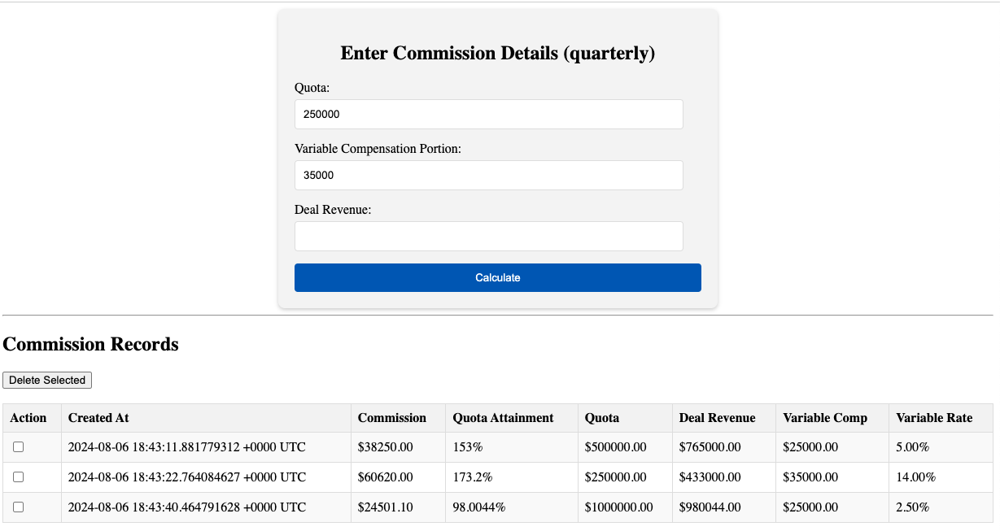

# A Go dev container with Chi routing and Sqlite3

A sandbox dev container for Go development that persists data in SQLite3 and uses Chi to build a simple web app. Go is a cross-platform, statically typed and compiled proramming language. A dev container (development container) is a self-contained dev environment with a Docker container allowing portability and instant creation of a dev environment without manual installation.

## dev container

I'm using a dev container so I don't have to install Go on my Mac. All I need a is a Docker daemon, which in my case is `colima` and VS Code with the dev container extension.

## Known Issues

In Coder's `envbuilder` project that leverages dev containers, lifecycle scripts in `devcontainer.json` like `postCreateCommand` and `postStartCommand` must redirect output to a file or `/dev/null` or the workspace hangs. Add `> /dev/null 2>&1` after any commands in those scripts.

## Resources

[Coder cloud development environment repo](https://github.com/coder/coder)

[Go](https://go.dev/)

[Dev Container specification](https://containers.dev/implementors/spec/)

[Coder's envbuilder OSS project](https://github.com/coder/envbuilder)

[Chi router](https://github.com/go-chi/chi)

[SQLite database](https://www.sqlite.org/)

## License

This project is licensed under the [MIT License](LICENSE)

## Contributing

### Disclaimer: Unmaintained and Untested Code

Please note that this program is not actively maintained or tested. While it may work as intended, it's possible that it will break or behave unexpectedly due to changes in dependencies, environments, or other factors.

Use this program at your own risk, and be aware that:
1. Bugs may not be fixed
1. Compatibility issues may arise
1. Security vulnerabilities may exist

If you encounter any issues or have concerns, feel free to open an issue or submit a pull request.